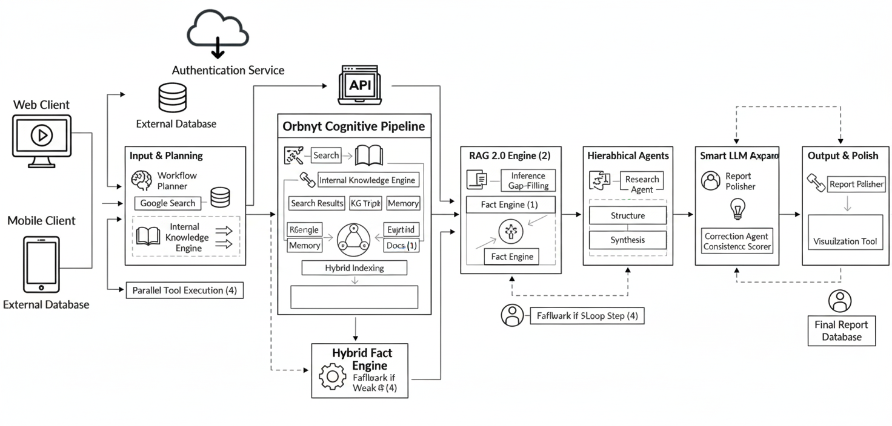

**Orbnyt: Autonomous Cognitive Agent System**
===
_Advanced Multi-Agent Pipeline for Web-Grounded Research, Knowledge Extraction, and Analytical Reporting_
===

**1. Project Summary**

Orbnyt is a fully autonomous multi-agent cognitive research system built using Google ADK 1.18.0.  
It transforms any open-ended natural-language query into a complete, structured research output through a deterministic, multi-stage agent pipeline.

_Key capabilities include:_
- Web-grounded search using ADK search tools  
- Hybrid RAG (dense embeddings + TF-IDF)  
- Knowledge graph extraction through JSON triples  
- Multi-domain numeric understanding  
- Interactive analytical dashboards  
- Memory-conditioned reasoning  
- Deterministic self-correction pipeline  
- Final structured technical report generation  

Orbnyt demonstrates production-grade agent design patterns and delivers interpretable, verifiable pipelines suitable for real-world analytical workloads.

---

**2. System Architecture**

The system follows a consistent **8-stage research pipeline**, with each stage implemented as a dedicated agent.  
A workflow self-correction layer guarantees deterministic, error-free execution by repairing invalid plans automatically.

    

**Core highlight:**  
The **Self-Correction Agent** enforces the required pipeline and ensures that every query passes through a validated, standardized reasoning flow—one of Orbnyt’s strongest engineering advantages.

---

**3. Key Features**

***3.1 Tool-Grounded Search***  
Retrieves precise factual information using Google Search through ADK’s native tool interface.

***3.2 Hybrid Retrieval (StrongRAG v3)***
- Dense embeddings using `text-embedding-004`
- Sparse keyword signals using TF-IDF
- Weighted fusion for robust relevance ranking  
This ensures high-quality evidence for all domains.

***3.3 Knowledge Graph Extraction***  
Converts text into clean, structured JSON triples suitable for graph analytics and visualization.

***3.4 Multi-Domain Numeric Extraction***  
Automatically identifies metrics across multiple categories:

- mAh, W, MP, Hz  
- GB, GHz  
- Price  
- Display size  
- Travel cost, trip duration, mileage  

Works seamlessly across consumer electronics, vehicles, travel planning, medicine, research, and general data.

***3.5 Automated Analytical Dashboards***  
Generates up to **10+ interactive Plotly dashboards** using validated numeric extraction.

***3.6 Workflow Self-Correction (Critical Component)***  
A dedicated agent validates and repairs the workflow, ensuring consistent execution of the required 8-stage pipeline.

***3.7 Final Technical Report***  
Outputs a structured enterprise-style research report containing:

- Executive Summary  
- Entity Overviews  
- Comparison Table  
- Knowledge Graph Insights  
- Numeric Interpretations  
- Final Conclusion  

---

**4. Example Outputs**

***4.1 Comparative Charts***

<table style="width:100%; border:0px;">
    <tr>
        <td style="width:50%; padding:5px;">
            
refresh rate(Hz) comparison

            
        </td>
        <td style="width:50%; padding:5px;">
            
charging speed comparison(W)

            
        </td>
    </tr>
</table>

<table style="width:100%; border:0px;">
    <tr>
        <td style="width:50%; padding:5px;">
            
battery capacity(mAh)

            
        </td>
        <td style="width:50%; padding:5px;">
            
storage comparison(GB)

            
        </td>
    </tr>
</table>

***4.2 Knowledge Graph Visualization***

    

***4.3 Standardized Comparison Table (Pricing normalized to USD)***

| Specification       | iPhone 16     | Pixel 9      |
|--------------------|---------------|--------------|
| Battery Capacity    | 3561 mAh      | 4700 mAh     |
| Camera Resolution   | 48 MP         | 50 MP        |
| Charging Power      | 25 W          | 45 W         |
| Refresh Rate        | 60 Hz         | 120 Hz       |
| Storage Options     | Up to 512 GB  | Up to 256 GB |
| Price (Standardized)| **$850**      | **$799**     |

*Prices normalized for consistent comparison.*

---

**5. Technical Stack**

***Core Components***
- Google ADK 1.18.0  
- Gemini 2.5 Flash  
- Google Search Tool  
- text-embedding-004  
- Scikit-learn TF-IDF  
- Plotly  
- Pandas  
- NetworkX  

***Environment***
- Python 3.11  
- Kaggle Notebook  
- In-memory session management  

---

**6. How to Run**

***1. Configure API Key***  
Add your Google API key to Kaggle Secrets.

***2. Run Initialization Cells***  
Initializes:
- Agents  
- Tools  
- RAG  
- Summarizer  
- Analyzer  
- Final report generator  
- Workflow self-correction  

***3. Execute a Query***  
Example:  
“Compare iPhone 16 vs Pixel 9 specifications, performance, camera, and price.”

***4. Review Outputs***  
Orbnyt automatically generates:
- Web-grounded search text  
- Summary  
- RAG context  
- Knowledge graph triples  
- Comparison dashboards  
- Final technical report  

No manual steps required.

---

**7. Limitations**

- Search dependency (quality limited by available data)  
- API rate limits  
- Sparse domains may yield fewer metrics  
- KG size depends on text richness  
- Strict non-hallucination rule (missing data not inferred)

---

**8. UX Vision & Deployment**

Orbnyt includes a companion external front-end (provided in `frontend.zip`) built to demonstrate:

- chat-style interface  
- interactive charts  
- streamed report rendering  

Due to Kaggle’s execution environment and deployment limitations, the front-end is included as a separate artifact rather than integrated into the notebook.

---

**9. Future Improvements (Version 2.0)**

**I. Enterprise Data Integration**
- Document ingestion (PDF, DOCX, TXT)  
- Domain-specific extraction modules  
- Local vector store  
- Query caching and retrieval history  

**II. User Experience**
- Real-time chat interface  
- Voice I/O  
- Long-session memory  
- Region-specific search and currency normalization  

**III. Advanced Cognition**
- Multi-entity (3–5 item) comparisons  
- Deeper KG analytics  
- Interactive dynamic dashboards  

**IV. Reporting**
- PDF/HTML export pipeline  
- Themeable enterprise report templates  

---

**Conclusion**

Orbnyt delivers a complete 8-stage autonomous research pipeline, combining workflow validation, hybrid RAG, structured extraction, numeric analytics, knowledge graphs, and enterprise-grade reporting.  
Its transparent, deterministic architecture makes it well-suited for high-stakes evaluation scenarios requiring reliability and interpretability.
